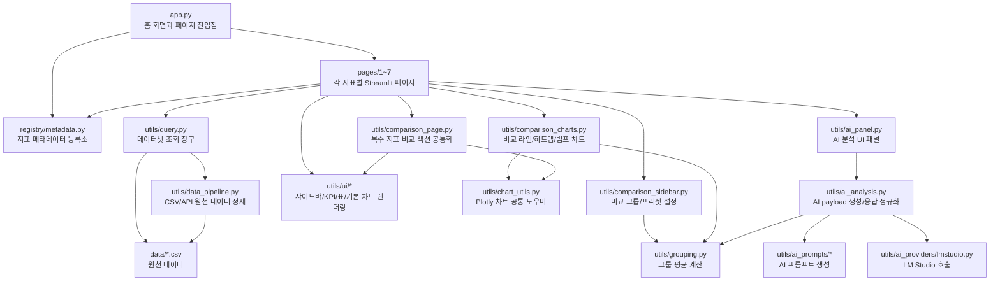
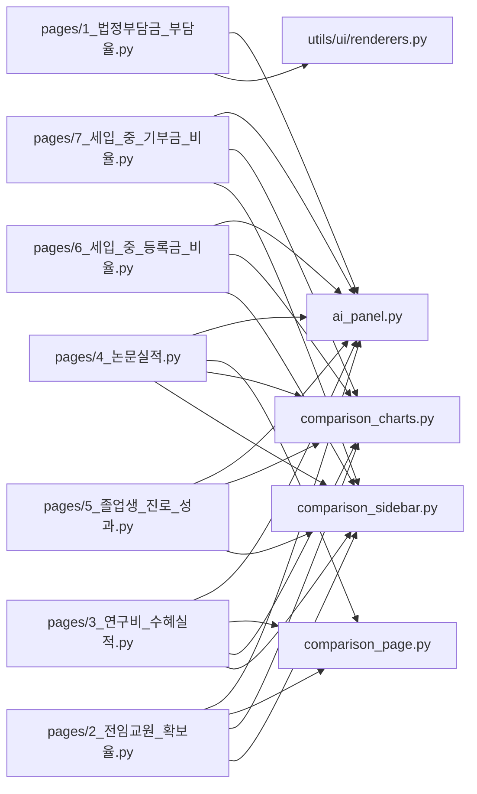
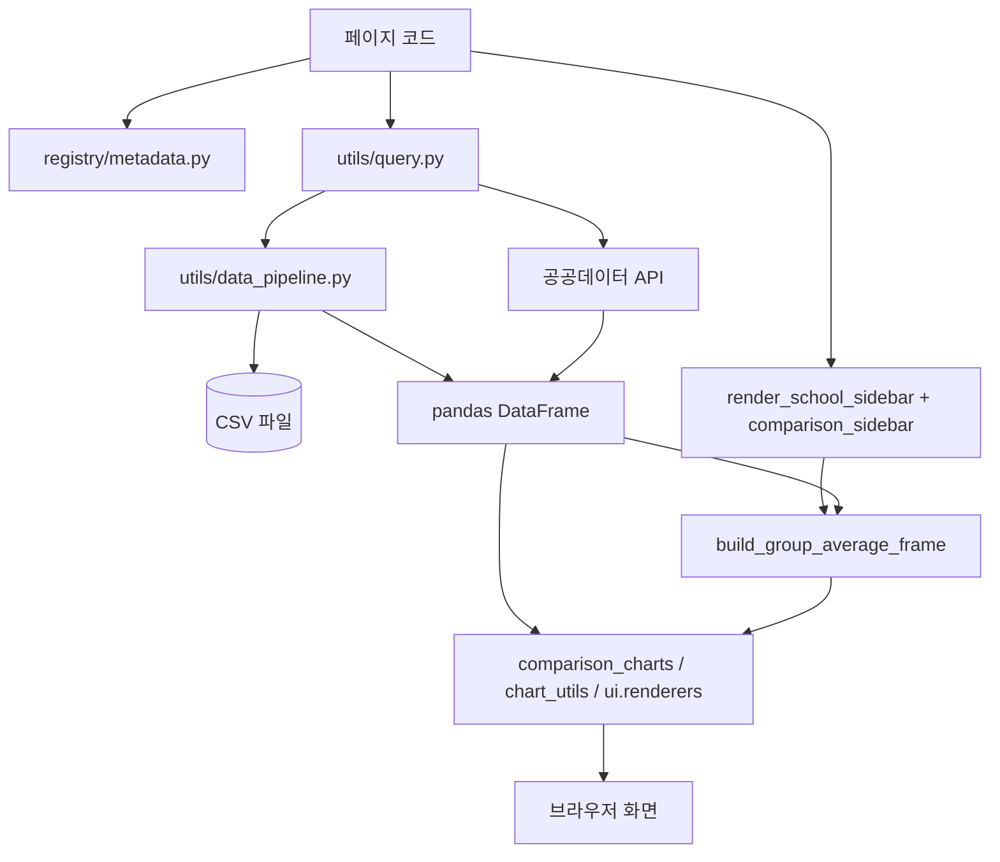
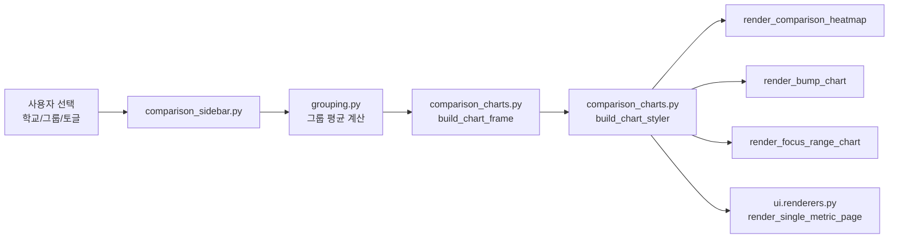
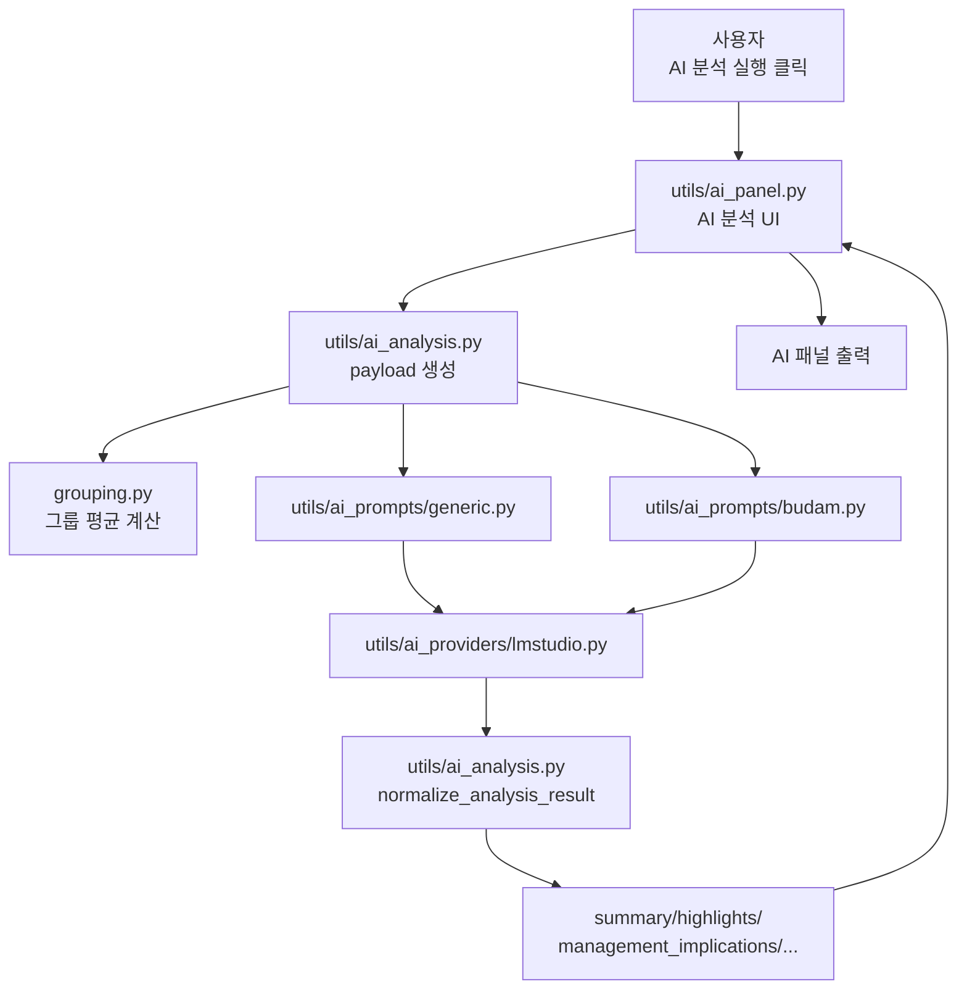

# 20260419 코드관계 Graph RAG

이 문서는 `visualization_14_ba_2` 프로젝트를 비전공자도 이해하기 쉽게 보기 위한 **Graph RAG 스타일 코드 관계도**입니다.

`Graph RAG`처럼 읽는 방법:

- `노드(Node)` = 파일 또는 모듈
- `엣지(Edge)` = 호출, 참조, 데이터 전달 관계
- `질문`을 먼저 정하고
- 그 질문과 연결된 노드들을 따라가면
- “어떤 코드가 어떤 역할을 하는지”를 빠르게 이해할 수 있습니다

---

## 1. 한눈에 보는 전체 구조

---

## 2. 비전공자용 핵심 해석

이 프로젝트는 크게 5단계로 작동합니다.

1. `app.py`와 `pages/1~7`이 화면을 띄웁니다.
2. `registry/metadata.py`가 “이 페이지는 어떤 지표를 보여줄지”를 알려줍니다.
3. `utils/query.py`와 `utils/data_pipeline.py`가 CSV 또는 API에서 데이터를 읽고 정리합니다.
4. `utils/ui`, `utils/comparison_*`, `utils/chart_utils.py`가 그래프와 표를 그립니다.
5. `utils/ai_panel.py -> utils/ai_analysis.py -> utils/ai_prompts/* -> lmstudio.py` 순서로 AI 분석이 생성됩니다.

즉, 아주 단순하게 말하면:

**페이지 코드가 데이터를 불러오고, 공통 유틸이 그래프를 그리며, 별도 AI 유틸이 해석 문장을 만드는 구조**입니다.

---

## 3. 페이지 계층 구조

### 페이지별 특징

- `pages/1_법정부담금_부담율.py`
  - 가장 먼저 확장된 페이지
  - 비교 그룹, 히트맵, 범프 차트, 확대 보기, AI 분석이 모두 들어감
  - 아직 일부 전용 로직이 남아 있어 “기준 페이지” 역할을 함

- `pages/2_전임교원_확보율.py`
  - 복수 시리즈를 갖는 페이지
  - 학생정원 기준 / 재학생 기준 비교
  - `comparison_page.py`를 통해 탭/단일학교 비교가 공통화됨

- `pages/3_연구비_수혜실적.py`
  - 교내 연구비 / 교외 연구비 2개 시리즈 사용
  - 복수 지표 비교 구조를 잘 보여주는 예시 페이지

- `pages/4_논문실적.py`
  - 국내 등재지 논문 / SCI급-SCOPUS 논문 비교
  - 페이지 2~3과 같은 복수 지표 패턴

- `pages/5~7`
  - 확장 완료된 단일/이중 지표 페이지들
  - 비교 그룹, 차트 확장, AI 분석 패널이 공통 유틸 기반으로 적용됨

---

## 4. 데이터 흐름 그래프

### 이 흐름을 쉽게 말하면

- 페이지는 “무슨 데이터를 쓸지”를 레지스트리에서 확인합니다.
- `query.py`가 “그 데이터셋을 어디서 가져올지”를 결정합니다.
- `data_pipeline.py`가 컬럼 이름을 정리하고 분석 가능한 DataFrame으로 변환합니다.
- 사용자가 고른 학교와 그룹 설정이 들어가면, `grouping.py`가 그룹 평균선을 만듭니다.
- 마지막으로 차트 유틸이 실제 Plotly 그래프를 그립니다.

---

## 5. 비교 기능 Graph RAG

### 각 파일의 역할

- [comparison_sidebar.py](/abs/path/C:/codex/visualization_14_ba_2/utils/comparison_sidebar.py)
  - 비교 그룹 프리셋과 그룹 이름/학교 선택 UI를 관리
  - “서울 소재 여대”, “주요 경쟁 대학” 같은 묶음을 만드는 곳

- [grouping.py](/abs/path/C:/codex/visualization_14_ba_2/utils/grouping.py)
  - 그룹 평균선을 계산
  - 예: “서울 소재 여대 평균”, “경쟁 대학 평균”

- [comparison_charts.py](/abs/path/C:/codex/visualization_14_ba_2/utils/comparison_charts.py)
  - 선택 학교 + 그룹 학교 + 그룹 평균을 하나의 차트용 데이터로 합침
  - 라인 강조, 우측 라벨, 히트맵, 범프 차트, 저구간 확대 차트를 그림

- [comparison_page.py](/abs/path/C:/codex/visualization_14_ba_2/utils/comparison_page.py)
  - 두 개 이상의 지표를 가진 페이지에서 탭, KPI, 단일학교 비교 차트를 공통 처리

---

## 6. AI 분석 Graph RAG

### AI 분석이 실제로 동작하는 순서

1. 사용자가 AI 분석 버튼을 누릅니다.
2. `ai_panel.py`가 현재 선택된 지표, 학교, 그룹 정보를 읽습니다.
3. `ai_analysis.py`가 AI에게 보낼 JSON payload를 만듭니다.
4. 그 payload는 `ai_prompts/generic.py` 또는 `ai_prompts/budam.py`에서 자연어 프롬프트로 바뀝니다.
5. `lmstudio.py`가 LM Studio 모델에 요청을 보냅니다.
6. AI 응답이 돌아오면 `normalize_analysis_result()`가 결과를 표준 형식으로 맞춥니다.
7. 최종적으로 화면에 요약, 기준 해석, 경영 시사점, 위험, 권고 액션이 표시됩니다.

### AI 결과 필드 의미

- `summary`
  - 전체 요약
- `highlights`
  - 눈에 띄는 포인트
- `threshold_assessment`
  - 인증 기준 또는 기준선 관점 해석
- `management_implications`
  - 대학 경영 관점의 의미
- `risks`
  - 주의할 점
- `recommended_actions`
  - 실행 권고
- `caveats`
  - 해석 시 유의사항

---

## 7. “이 기능은 어디서 구현됐지?” 빠른 탐색표

| 궁금한 기능 | 먼저 볼 파일 | 그다음 볼 파일 | 이유 |
|---|---|---|---|
| 홈 화면은 어디서 만들었나? | [app.py](/abs/path/C:/codex/visualization_14_ba_2/app.py) | [registry/metadata.py](/abs/path/C:/codex/visualization_14_ba_2/registry/metadata.py) | 홈은 메타데이터를 읽어 페이지 링크를 구성함 |
| 페이지 목록/지표 설정은 어디에 있나? | [registry/metadata.py](/abs/path/C:/codex/visualization_14_ba_2/registry/metadata.py) | 각 `pages/*.py` | 페이지 제목, CSV, 기본 학교, 기준선이 등록됨 |
| 데이터는 어디서 불러오나? | [query.py](/abs/path/C:/codex/visualization_14_ba_2/utils/query.py) | [data_pipeline.py](/abs/path/C:/codex/visualization_14_ba_2/utils/data_pipeline.py) | 조회 창구와 전처리가 분리되어 있음 |
| 비교 그룹은 어디서 만들었나? | [comparison_sidebar.py](/abs/path/C:/codex/visualization_14_ba_2/utils/comparison_sidebar.py) | [grouping.py](/abs/path/C:/codex/visualization_14_ba_2/utils/grouping.py) | UI 선택과 평균 계산이 나뉘어 있음 |
| 메인 비교 차트는 어디서 그리나? | [comparison_charts.py](/abs/path/C:/codex/visualization_14_ba_2/utils/comparison_charts.py) | [chart_utils.py](/abs/path/C:/codex/visualization_14_ba_2/utils/chart_utils.py) | 비교 차트 조립 + Plotly 공통 도우미 |
| 기본 KPI/표/정의 박스는 어디서 나오나? | [utils/ui/renderers.py](/abs/path/C:/codex/visualization_14_ba_2/utils/ui/renderers.py) | [utils/ui/tables.py](/abs/path/C:/codex/visualization_14_ba_2/utils/ui/tables.py) | 화면 공통 블록 렌더링 담당 |
| AI 분석은 어디서 구현됐나? | [ai_panel.py](/abs/path/C:/codex/visualization_14_ba_2/utils/ai_panel.py) | [ai_analysis.py](/abs/path/C:/codex/visualization_14_ba_2/utils/ai_analysis.py) | UI와 로직이 분리됨 |
| AI 프롬프트는 어디서 바꾸나? | [ai_prompts/generic.py](/abs/path/C:/codex/visualization_14_ba_2/utils/ai_prompts/generic.py) | [ai_prompts/budam.py](/abs/path/C:/codex/visualization_14_ba_2/utils/ai_prompts/budam.py) | 공통형과 법정부담금 전용형이 따로 있음 |

---

## 8. “질문 중심” Graph RAG 탐색 경로

### 질문 1. “전임교원 확보율 페이지는 어떤 파일들이 협력해서 움직이나?”

탐색 경로:

`pages/2_전임교원_확보율.py`
→ `registry/metadata.py`
→ `query.py`
→ `comparison_sidebar.py`
→ `comparison_charts.py`
→ `comparison_page.py`
→ `ai_panel.py`

의미:

- 페이지 파일은 오케스트라 지휘자 역할입니다.
- 실제 연주는 공통 유틸들이 나눠서 수행합니다.

### 질문 2. “히트맵과 범프 차트는 어디서 만들어졌나?”

탐색 경로:

`comparison_charts.py`
→ `render_comparison_heatmap()`
→ `render_bump_chart()`
→ `chart_utils.py`

의미:

- 히트맵/범프 차트는 비교 차트 전용 공통 유틸에 모여 있습니다.

### 질문 3. “AI 분석 버튼을 누르면 실제로 무슨 일이 일어나나?”

탐색 경로:

`ai_panel.py`
→ `ai_analysis.py`
→ `ai_prompts/generic.py`
→ `ai_providers/lmstudio.py`

의미:

- 패널은 버튼과 결과 표시에 집중합니다.
- 실제 분석 준비는 `ai_analysis.py`
- AI에게 말 거는 방식은 `ai_prompts/*`
- 실제 모델 호출은 `lmstudio.py`

### 질문 4. “비교 대상 그룹 평균선은 어디서 계산되나?”

탐색 경로:

`comparison_sidebar.py`
→ `grouping.py`
→ `comparison_charts.py`

의미:

- 사용자가 그룹을 고르면
- `grouping.py`가 평균선을 계산하고
- 그 결과를 차트에 섞어서 보여줍니다

---

## 9. 코드 역할을 사람 비유로 설명하면

- `app.py`
  - 안내 데스크
- `pages/*.py`
  - 각 전시관의 담당 큐레이터
- `registry/metadata.py`
  - 전시 카탈로그
- `query.py`
  - 자료 요청 창구
- `data_pipeline.py`
  - 원본 자료 정리팀
- `comparison_sidebar.py`
  - 비교 대상 설정 도우미
- `grouping.py`
  - 그룹 평균 계산 담당 분석관
- `comparison_charts.py`
  - 시각화 디자이너
- `utils/ui/*`
  - 화면 배치 디자이너
- `ai_panel.py`
  - AI 분석 상담 창구
- `ai_analysis.py`
  - AI에게 넘길 보고서 초안 작성자
- `ai_prompts/*`
  - AI에게 질문을 잘 쓰는 프롬프트 전문가
- `lmstudio.py`
  - 실제 AI 모델과 대화하는 통역사

---

## 10. 추천 읽기 순서

비전공자에게 추천하는 읽기 순서는 아래와 같습니다.

1. [app.py](/abs/path/C:/codex/visualization_14_ba_2/app.py)
2. [registry/metadata.py](/abs/path/C:/codex/visualization_14_ba_2/registry/metadata.py)
3. 원하는 페이지 하나
   - 예: [2_전임교원_확보율.py](/abs/path/C:/codex/visualization_14_ba_2/pages/2_전임교원_확보율.py)
4. [query.py](/abs/path/C:/codex/visualization_14_ba_2/utils/query.py)
5. [comparison_sidebar.py](/abs/path/C:/codex/visualization_14_ba_2/utils/comparison_sidebar.py)
6. [comparison_charts.py](/abs/path/C:/codex/visualization_14_ba_2/utils/comparison_charts.py)
7. [ai_panel.py](/abs/path/C:/codex/visualization_14_ba_2/utils/ai_panel.py)
8. [ai_analysis.py](/abs/path/C:/codex/visualization_14_ba_2/utils/ai_analysis.py)
9. [generic.py](/abs/path/C:/codex/visualization_14_ba_2/utils/ai_prompts/generic.py)

이 순서로 보면:

- “무엇을 보여주는 앱인지”
- “어떤 지표가 있는지”
- “한 페이지가 어떻게 만들어지는지”
- “데이터와 그래프와 AI가 어떻게 연결되는지”

를 자연스럽게 이해할 수 있습니다.

---

## 11. 다음에 확장하면 좋은 방향

이 문서를 더 발전시키려면 아래도 가능합니다.

- 실제 import 관계를 자동 스캔해서 `graph.json` 생성
- Mermaid를 더 세분화해서 페이지별 서브그래프 생성
- “법정부담금 페이지만 따로” 또는 “AI 분석만 따로” 도식화
- 코드 관계를 클릭형 HTML 문서로 변환

원하면 다음 단계로 바로

1. **페이지 1~7 전체를 자동으로 그리는 Graph JSON 생성기**
2. **Mermaid를 페이지별로 더 세분화한 문서**
3. **AI 분석 흐름만 따로 떼어 설명하는 전용 문서**

중 하나까지 이어서 만들어드릴 수 있습니다.
