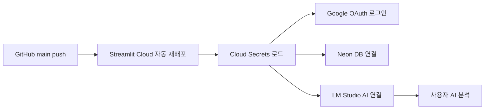
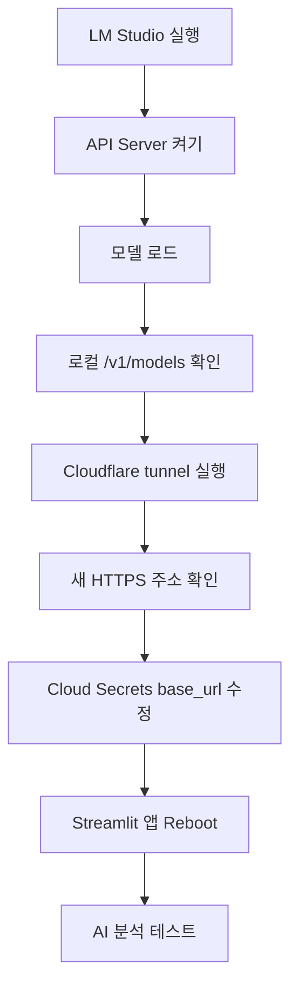
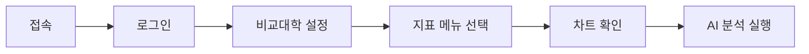

# Streamlit Cloud 운영자/사용자 매뉴얼

작성 기준: 2026-04-29
대상 앱: `visualization_14_ba_2`
배포 주소: `https://visualization14ba2-tkmb6haxk33hsycrwzhs8a.streamlit.app/`

이 문서는 민감값을 포함하지 않습니다. `client_secret`, DB URL, API 토큰, 실제 임시 터널 주소는 Streamlit Cloud Secrets 또는 로컬 `.streamlit/secrets.toml`에만 저장합니다.

## 한 장 요약



## 운영자용

### 1. 운영자가 관리하는 것

| 영역 | 위치 | 확인할 내용 |
| --- | --- | --- |
| 코드 | GitHub `main` 브랜치 | 기능 추가 후 commit, push |
| 배포 | Streamlit Cloud 앱 관리 화면 | 앱 상태, 로그, Reboot |
| 인증 | Google Cloud Console | OAuth callback URI |
| 비밀값 | Streamlit Cloud Secrets | auth, DB, 관리자, LM Studio |
| 데이터 | Neon PostgreSQL | 접속 URL, DB 상태 |
| AI | LM Studio + 외부 터널 | 모델 로드, base URL, 터널 상태 |

### 2. 배포 후 필수 점검

1. Streamlit Cloud 주소로 접속합니다.
2. Google 로그인 버튼이 보이는지 확인합니다.
3. 로그인 후 메뉴와 비교대학 설정이 정상 표시되는지 확인합니다.
4. 주요 지표 화면 하나를 열어 차트가 표시되는지 확인합니다.
5. AI 분석을 실행해 응답이 생성되는지 확인합니다.

통과 기준: 로그인, DB, AI 분석이 모두 정상이어야 운영 준비 완료입니다.

### 3. Cloud Secrets 구조

Streamlit Cloud 앱의 `Settings > Secrets`에 아래 구조로 저장합니다. 실제 값은 운영자가 보유한 값을 넣습니다.

```toml
[auth]
redirect_uri = "https://visualization14ba2-tkmb6haxk33hsycrwzhs8a.streamlit.app/oauth2callback"
cookie_secret = "<긴_랜덤_문자열>"
client_id = "<Google OAuth Client ID>"
client_secret = "<Google OAuth Client Secret>"
server_metadata_url = "https://accounts.google.com/.well-known/openid-configuration"

[connections.neon]
url = "<Neon PostgreSQL 접속 URL>"

[app_auth]
admin_emails = ["<관리자 Google 이메일>"]

[lmstudio]
base_url = "https://<터널주소>.trycloudflare.com/v1"
model = "supergemma4-e4b-abliterated-mlx"
# api_key = "인증을 켠 경우에만 입력"
```

### 4. Google OAuth callback 확인

Google Cloud Console의 OAuth 클라이언트에서 승인된 리디렉션 URI에 아래 값이 있어야 합니다.

```text
https://visualization14ba2-tkmb6haxk33hsycrwzhs8a.streamlit.app/oauth2callback
```

로컬 테스트도 필요하면 아래 값도 함께 유지합니다.

```text
http://localhost:8501/oauth2callback
```

### 5. LM Studio AI 재연결 절차

현재 AI 기능은 LM Studio가 실행 중인 Mac에 의존합니다. Mac을 끄거나 터널이 종료되면 웹 앱은 접속되어도 AI 분석은 실패합니다.



명령 예시는 다음과 같습니다.

```bash
curl http://127.0.0.1:1234/v1/models
cloudflared tunnel --url http://127.0.0.1:1234
curl https://<터널주소>.trycloudflare.com/v1/models
```

Secrets에는 터널 주소 뒤에 `/v1`을 붙여 저장합니다.

```toml
[lmstudio]
base_url = "https://<터널주소>.trycloudflare.com/v1"
model = "supergemma4-e4b-abliterated-mlx"
```

### 6. 내 컴퓨터를 계속 켤 수 없을 때

| 선택지 | 설명 | 적합한 경우 |
| --- | --- | --- |
| 임시 터널 유지 | Mac + LM Studio + quick tunnel | 짧은 테스트 |
| 상시 서버 운영 | 항상 켜진 서버에 LM Studio 호환 API 구성 | 장기 운영 |
| 클라우드 LLM 전환 | OpenAI, Gemini 등 외부 API 사용 | PC 의존성 제거 |

장기 운영에서는 임시 터널보다 상시 서버 또는 클라우드 LLM 전환이 안정적입니다.

## 사용자용

### 1. 접속과 로그인

1. 배포 주소를 엽니다.
2. Google 로그인 버튼을 누릅니다.
3. 허용된 계정으로 로그인합니다.
4. 왼쪽 메뉴가 보이면 정상 접속입니다.

### 2. 기본 사용 흐름



### 3. 화면별 사용 팁

| 화면 | 사용 방법 |
| --- | --- |
| 경영 인사이트 대시보드 | 전체 지표의 흐름을 먼저 확인합니다. |
| 비교대학 설정 | 관심 대학과 비교 그룹을 저장합니다. |
| 지표별 화면 | 차트, 표, 기준값을 함께 확인합니다. |
| AI 분석 | 분석 톤과 초점을 선택한 뒤 실행합니다. |

### 4. 오류가 날 때 사용자 조치

1. 새로고침합니다.
2. 로그아웃 후 다시 로그인합니다.
3. 같은 오류가 반복되면 화면 캡처와 오류 문구를 운영자에게 전달합니다.

## 오류별 빠른 판단

| 오류 문구 | 주된 원인 | 운영자 조치 |
| --- | --- | --- |
| 접근 권한이 없습니다 | 허용되지 않은 Google 계정 | 관리자 화면 또는 DB 권한 확인 |
| redirect_uri_mismatch | OAuth callback URI 누락 | Google Cloud Console에 callback 추가 |
| Neon DB 연결 설정 필요 | DB Secret 누락 또는 오타 | `[connections.neon]` 확인 |
| LM Studio 연결 상태 확인 | LM Studio, 터널, 모델 설정 문제 | API Server, tunnel, `[lmstudio]` 확인 |
| 앱이 재시작 중입니다 | 배포 또는 Reboot 직후 | 1-3분 대기 후 새로고침 |

## 운영자 최종 체크리스트

- [ ] GitHub `main` 브랜치가 최신인지 확인
- [ ] Streamlit Cloud 배포 상태 확인
- [ ] Cloud Secrets 저장 구조 확인
- [ ] Google OAuth callback URI 확인
- [ ] Neon DB 연결 확인
- [ ] LM Studio API Server와 모델 로드 확인
- [ ] 외부 터널 URL 확인
- [ ] `[lmstudio].base_url`을 새 터널 주소 + `/v1`로 저장
- [ ] Streamlit Cloud 앱 Reboot
- [ ] 로그인, 지표 차트, AI 분석까지 최종 테스트
